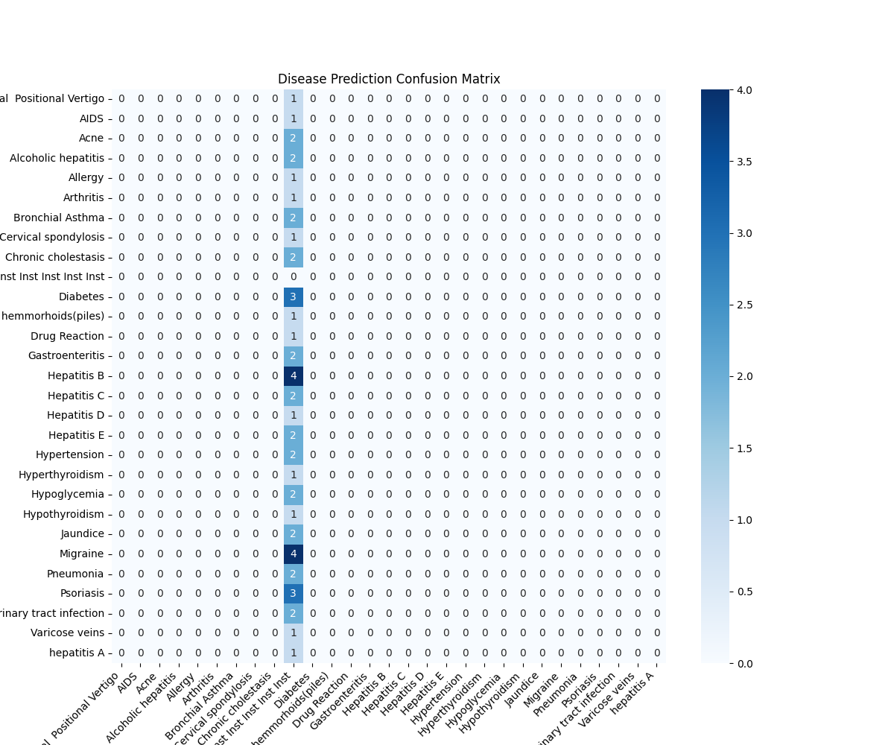

# 🏥 AI Disease Suggestion Model (Fine-Tuned LLM)

## 📌 Project Overview
This project demonstrates how a lightweight Large Language Model (TinyLlama-1.1B) can be fine-tuned to suggest possible diseases based on user-input symptoms. The model was trained using **QLoRA (Quantized Low-Rank Adaptation)**, which allows efficient fine-tuning on consumer GPUs like Google Colab's T4.

> ⚠️ **Disclaimer:** This project is for **educational and research purposes only**. The model is **not** a medical professional. Do not use it for real medical diagnosis.

---

## 🎯 Objectives
- Fine-tune the TinyLlama model using QLoRA on a disease-symptom dataset.
- Enable natural language symptom interpretation.
- Produce structured outputs including:
  - **Disease Name**
  - **Explanation**
  - **Safety Disclaimer**

---

## 🛠️ Tech Stack
- **Model:** TinyLlama-1.1B-Chat
- **Fine-Tuning Method:** QLoRA (4-bit quantization + PEFT)
- **Libraries Used:**
  - `transformers`
  - `peft`
  - `trl`
  - `bitsandbytes`
  - `scikit-learn`
- **Environment:** Google Colab (Free GPU – T4)

---

## 📂 Repository Structure
```
├── LLM_Assignment_Disease_Prediction.ipynb  # Full training + evaluation notebook
├── train.jsonl                              # Training dataset
├── test.jsonl                               # Testing dataset
├── confusion_matrix.png                      # Evaluation heatmap
└── README.md                                 # Project documentation
```

---

## 📊 Evaluation: Confusion Matrix
The model was evaluated on unseen symptoms. Below is the confusion matrix illustrating its classification accuracy:



---

## 🚀 Running the Model
You can load the fine-tuned model using the base model + adapter weights.

```python
from peft import PeftModel
from transformers import AutoModelForCausalLM, AutoTokenizer

# Load base model
tokenizer = AutoTokenizer.from_pretrained("TinyLlama/TinyLlama-1.1B-Chat-v1.0")
base_model = AutoModelForCausalLM.from_pretrained(
    "TinyLlama/TinyLlama-1.1B-Chat-v1.0",
    device_map="auto"
)

# Load fine-tuned adapter
model = PeftModel.from_pretrained(base_model, "path/to/adapter")
model = model.merge_and_unload()

# Inference
prompt = "I have fever, body ache, and sore throat. What could it be?"
inputs = tokenizer(prompt, return_tensors="pt").to(model.device)
outputs = model.generate(**inputs, max_new_tokens=150)
print(tokenizer.decode(outputs[0], skip_special_tokens=True))
```

---

## 🧪 Example Output
```
Disease: Influenza (Flu)
Explanation: Your symptoms such as fever, body ache, and sore throat often occur during viral influenza infections.
Disclaimer: This is not medical advice. Please consult a certified doctor for accurate diagnosis.
```

---

## 📦 Dataset
The dataset was sourced from Kaggle and formatted into JSONL for LLM fine-tuning.
Each entry includes:
```json
{
  "input": "fever, headache, chills",
  "output": "Disease: Malaria | Explanation: ... | Disclaimer: ..."
}
```

---

## 🔧 Training Details
- **QLoRA** enabled efficient fine-tuning with 4-bit quantization.
- **PEFT** (Parameter-Efficient Fine-Tuning) was used to train only adapter layers.
- Training was completed on a **T4 GPU** within Colab Free Tier.

---

## 📌 Future Improvements
- Add confidence scores
- Improve dataset quality
- Deploy as a REST API or Streamlit app
- Expand disease categories

---

## 🙌 Acknowledgements
- TinyLlama team for the base model
- Hugging Face libraries for training scaffolding
- Kaggle for the disease-symptom dataset

---

## 📜 License
This project is open-source for educational use only. Not intended for real healthcare applications.

